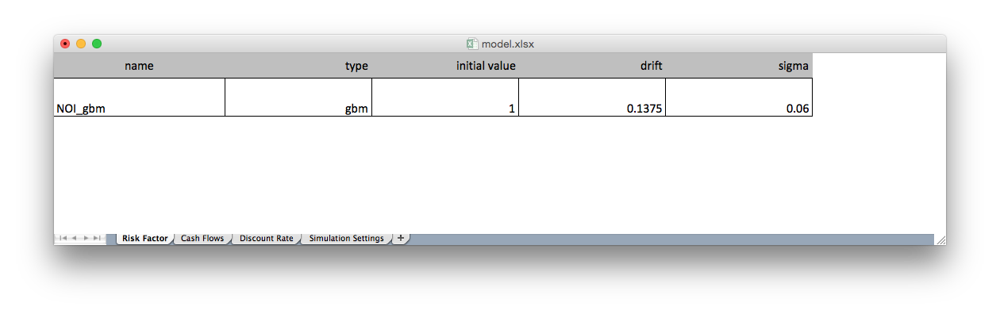
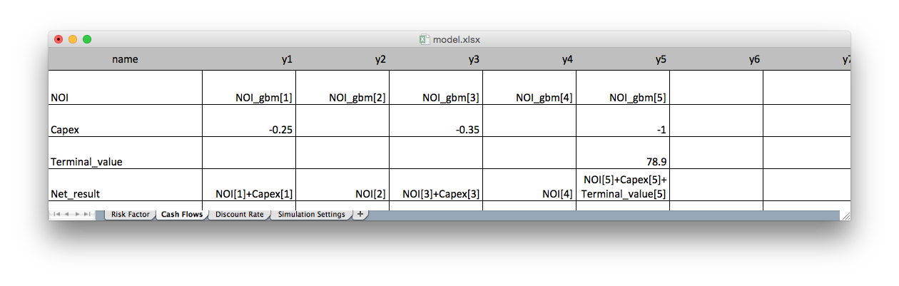
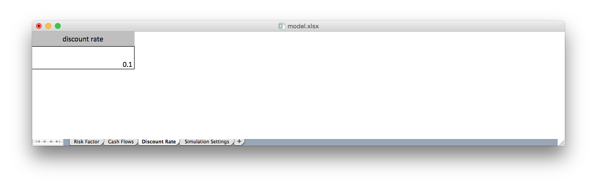
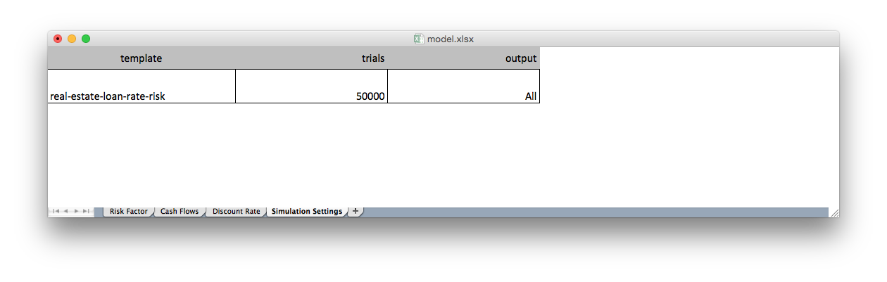

# Real Estate Net Operating Income Risk

Risk model accessible on http://app.airr.io remotely by registered users.

## Documentation

This template is made of four tabs:

* [Risk Factor](#risk_factor)
* Cash Flows
* Discount Rate
* Simulation Settings

###Risk Factor

This template supports the [Geometric Brownian motion](https://en.wikipedia.org/wiki/Geometric_Brownian_motion).

(#some-markdown-heading)
### Cash Flows

The Cash flows are the financial objects the risk engine will simulate.
This template tells the engine that the NOI component should take, at the first 5 annual steps, the corresponding value of the risk factor.

### Discount Rate

### Simulation Settings

## Output

The risk engines outputs are, for each cash flow:

* statistics : expected value and histogram of net present values
* paths : all simulated paths

### Statistics examples
(#risk-factor)
#### NOI_npv

|expected value|
|-------------:|
|5.69|

|histogram|bin edges|
|--------:|--------:|
|1|3.95|
|1|4|
|2|4.04|
|6|4.09|
|8|4.13|
|12|4.18|
|9|4.23|
|20|4.27|
|28|4.32|
|40|4.36|
|...|...|
|0|8.37|
|0|8.41|
|0|8.46|
|1|8.51|
||8.55|

#### Net_result_npv

|expected value|
|-------------:|
|53.57|

|histogram|bin edges|
|--------:|--------:|
|1|51.83|
|1|51.88|
|2|51.92|
|6|51.97|
|8|52.01|
|12|52.06|
|9|52.11|
|20|52.15|
|28|52.2|
|40|52.24|
|...|...|
|0|56.25|
|0|56.29|
|0|56.34|
|1|56.39|
||56.43|
